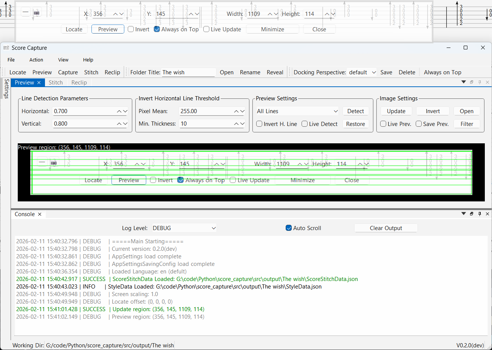
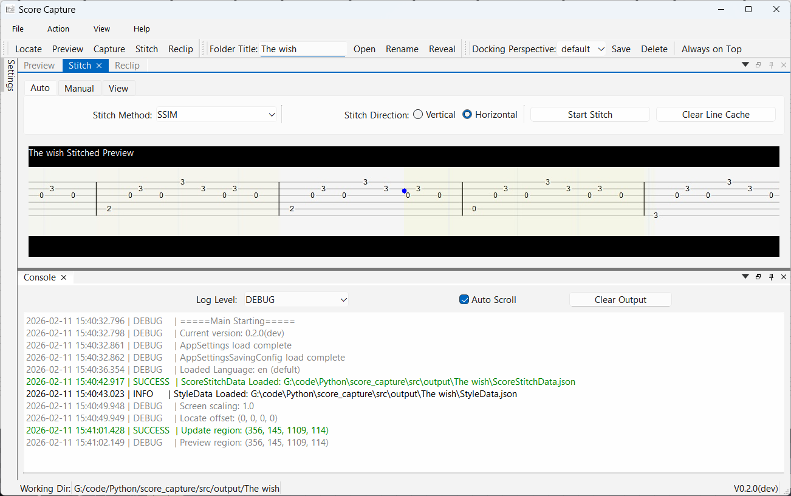
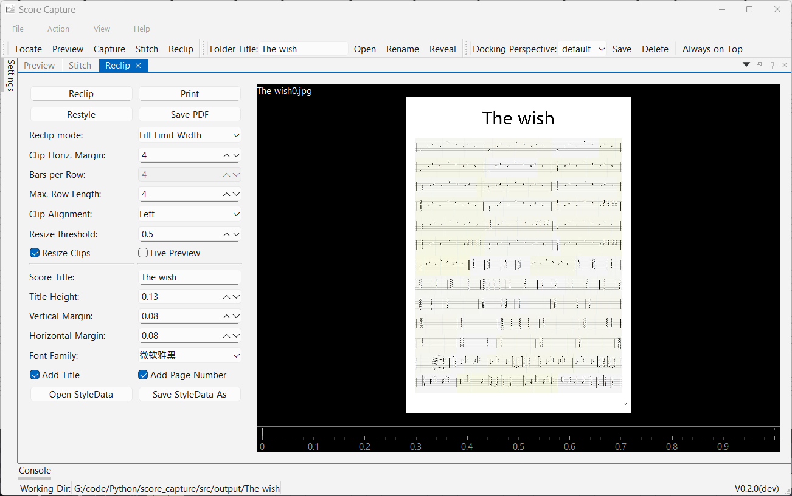

# Score Capture

[简体中文](../README.md)  [English](README_en.md)

Capture, Detect, Stitch and Reclip music score/TAB from scrolling video to generate printable images.

    
UI Screenshots

    
    
    
    

## Features
- [x] Supports vertically or horizontally scrolling score videos
- [x] Detects staff lines and automates stitching
- [x] User-friendly manual stitching adjustment tools
- [x] Basic score style editing
- [x] Cross-platform screenshot capability via the MSS library or command-line tools
- [x] Dynamic preview location based on the window
- [x] Extract images directly from local video files
- [x] Responsive UI settings
- [x] Docking layout based on QtAds
- [ ] Mouse-drag selection locating system
- [ ] Improved cross-platform support
- [ ] Staff (five-line) optimization
- [ ] Multi-track support

## i18n
- [x] English
- [x] 简体中文

## Installation / Usage

    
Run/Develop from Source

    Get the source code and cd to the project root directory.

    git clone https://github.com/Carrot-shreds/score_capture.git
    cd score_capture

Install the uv environment.

    curl -LsSf https://astral.sh/uv/install.sh | sh  (Linux/MacOS)
    winget install --id=astral-sh.uv  -e  (Windows)
    or
    pip install uv

Sync the build environment (development dependencies are not included by default).

    uv sync
    or
    uv sync --dev

Compile Qt resource files.

    uv run tools.py build

Run the program entry point.

    uv run main.py
    (Linux) bash main.sh

Update the repository.

    git pull

Build from source.

    uv run build.py

If you are using 64-bit Windows 10 or above, please download the latest `score_capture_xxx_win64.zip` from the [releases](https://github.com/Carrot-shreds/score_capture/releases/). Extract it to a suitable location and launch `score_capture.exe`. No additional installation is required. All configurations and dependencies are packaged into an independent folder for easy portability and uninstallation.
For MacOS and Linux users, pre-compiled versions are not currently provided. Please refer to the instructions above and attempt to run from source.

## File Naming Conventions
    ## Images
    capture: Original screenshot images, possibly inverted per settings.
    image: Images generated by averaging groups of similar captures, used for subsequent steps.
    detected: Original images overlaid with line detection results.
    stitched: Images resulting from stitching the 'image' files.
    barlines: Preview image showing only detected bar lines, used for re-clipping.
    reclip: Horizontally stitched images after re-clipping, or identical to vertically stitched images.
    
    ## Data Files (json)
    CaptureData: Stores comparison data between captures, used for rebuild 'image' files.
    ScoreDetections: Serves as a cache for line detection on 'image' files, used for stitching.
    StitchData: Stitching point result data, can be opened for visual editing from the manual stitching window.
    StyleData: Stores style settings for the final generated images.

## Configuration Files
Located in the `config` folder.

    AppSettings: Stores the majority of the application's settings, can be edited manually.
    AppSettingsSavingConfig: AppSettings defaults to saving all settings. If disabled, only items set to true in AppSettingsSavingConfig will be saved.
    dockSettings: Stores all UI docking view presets.
It is recommended to frequently back up the configuration files to avoid accidental loss or overwriting. Simply copy the entire `config` folder.

## Workflow
> Image filenames: capture[1-n] -> image[1-n] -> title-stitched -> title-recliped -> title[1-n]
0. Use `[Main Output Directory]//[Folder Title]` as the working directory.
1. **(Locating)** Obtain the score area using the locate window.
2. **(Preview)** Preview the range and line detection parameters via the preview window (optional).
3. **(Capture)** Start capture, play the video, end capture. During this process, a `capture*.*` image is generated at specified intervals. Subsequently, two or more "identical" (similar) captures are merged into one `image*.*`.
- Or you also can extract frames from local video file using the `VideoCrop` tab. The frames will also be saved as `capture`, and can be built to `image`.
4. **(Detection)** Use the set parameters to perform line detection on each `image`, generating `image-detected` and `ScoreDetections.json`. The primary goal is to obtain the positions of bar lines (vertical lines) as a reference for stitching.
5. **(Stitching)** Using the area around each bar line as a reference, adjacent `image` files are stitched together. The most "perfect" (most similar) overlapping position is found, saved to `ScoreStitchData.json`, and the stitched image `title-stitched` is generated.
6. **(Re-clipping)** Perform line detection on `title-stitched`, generating `title-stitched-detected` and `title-stitched-barlines`. The goal is again to obtain bar lines within the stitched image, which are used to split the long horizontal image at points around the bar lines and reformat it vertically, generating `title-reclip`.
7. If the stitched image is already vertically oriented, additional detection for inverted horizontal lines (the blank parts between two complete rows of the score) is performed to avoid splitting a single row. A preview is saved to the `title-blank-gaps` image.
8. **(Style Editing)** Split `title-reclip` according to print proportions, add margins/titles/page numbers, and other styles. Finally, generate `title*.*` files or save to PDF.

## Shortcuts
    ## Main Window
    Ctrl 1-9: Switch to ui docking preset number.
    F12: Toggle window always-on-top state.
    F1-F5: Main actions.
    
    ## File
    Ctrl-o: Open a folder as the working folder.
    Ctrl-r: Rename the current folder.
    Ctrl-p: Print the current score result.
    
    ## Locate
    Mouse-left-double-click: Switch showing mode.
    Mouse-right-double-click: Minimize window.
    F12: Toggle window always-on-top state.
    l: Update location.
    p: Preview region.
    
    ## Manual Stitching Tab
    1-3: Switch tabs.
    ↑/↓: Switch between stitching points.
    ←/→: Adjust the value of the current stitching point.
    ↑/↓/←/→ + Ctrl/Shift: Different adjustment step sizes.
    PageUp/PageDown: Set stitching point value to min/max.
    Home/End: Jump to first/last stitching point.
    Ctrl+s: Save stitching data and result image.

## FAQ
### Is Score Capture cross-platform?
Yes! This project is based on Python and PySide (Python bindings for Qt) and is designed to support cross-platform desktop use on Windows, MacOS, and Linux. However, testing on non-Windows platforms is currently limited, and there may be some compatibility issues.
### Why can't it run on Windows 7?
The official Python support for Windows 7 ended after version 3.9, requiring community ports. There are currently no plans for this.
### Why is the title displayed as blank when editing styles?
Make sure to select the correct font that includes the character set required for displaying the title. Also, check that the "Add Title" option is enabled and ensure that a sufficient "Title Height" is set.
### Why can't I type with my fcitx input method?
When running on Linux, please launch the main program using `bash main.sh` to ensure the libfcitx5 plugin is loaded. If the pre-compiled plugin fails to load, try recompiling it with `bash fcitx5-qt.sh`.
### Does it support [xxx] type of sheet music?
Considering the variety of score types and differing video qualities, development testing cannot cover all scenarios. Development will prioritize **horizontally scrolling TAB sheet music**. Support for other types like vertically scrolling scores or standard staff notation will be improved based on more user testing and feedback. If you encounter issues, please try using the manual stitching tools or report it as an issue.

## Contribution
This project is under continuous development. Contributions of all forms are welcome, including but not limited to:
- Reporting bugs
- Suggesting new features
- Supplementing documents
- Cross-platform testing feedback
- Improving i18n translations

When reporting bugs via GitHub issues, please provide as much information as possible, including logs and images from the working directory, the main log from the `log` folder, system version/environment, configuration file information, online video links, etc.

## Contact Me
If you are interested in contributing ideas or code to Score Capture, you can contact Carrot_shreds@163.com.

## [License](../LICENSE)
This project is free software released under the GPL v3 license. Closed-source commercial sale and distribution are prohibited.

## Disclaimer
The musical scores captured and generated by this software are for learning and communication purposes only. All rights belong to the original authors of the videos or scores. Unauthorized use for other purposes is prohibited. The software author shall not be held responsible for any copyright issues arising from the use of this software.
